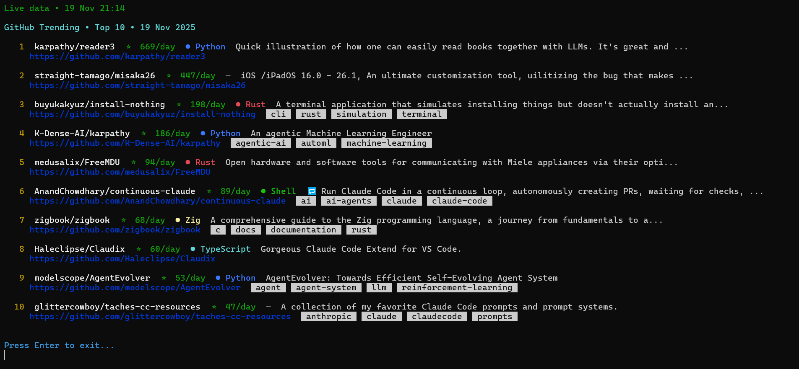

<div align="center">

# 🚀 ghtrend: GitHub Trending CLI



**A blazing-fast, beautiful, and feature-rich command-line interface to discover trending repositories on GitHub right from your terminal!** ⚡

</div>

## ✨ Features

| Feature                    | Description                                                     |
| -------------------------- | --------------------------------------------------------------- |
| ⚡ **Real-time Data**      | Fetches live data directly from GitHub's official API           |
| 🎨 **Beautiful Output**    | Color-coded terminal output with GitHub-style language colors   |
| 🔧 **Advanced Filtering**  | Filter by language, time range, spoken language, and star count |
| 🌐 **Proxy Support**       | Built-in proxy support for restricted networks                  |
| 💾 **Multiple Formats**    | Terminal display, JSON output, file export (TXT/JSON)           |
| 🌍 **Browser Integration** | Open top repositories directly in your browser                  |
| 🛡️ **Fallback System**     | Smart caching when API is unavailable                           |
| 📱 **Cross-Platform**      | Works on Windows, macOS, and Linux                              |

## 🚀 Installation

### Method 1: Using Pre-built Binaries (Recommended)

1. **Download the latest release from the [Releases Page](https://github.com/vasei-me/GitHub_Trending_CLI/releases)**
2. **Extract the binary and add it to your PATH**

### Method 2: Build from Source

```bash
# Clone the repository
git clone https://github.com/vasei-me/GitHub_Trending_CLI.git
cd GitHub_Trending_CLI/ghtrend

# Build the binary
go build -o ghtrend main.go

# Move to system PATH (Linux/macOS)
sudo mv ghtrend /usr/local/bin/

# Or add to PATH manually (Windows)
# Add the directory containing ghtrend.exe to your System PATH
```

### Method 3: Go Install

```bash
go install github.com/vasei-me/GitHub_Trending_CLI/ghtrend@latest
```

## 🎯 Quick Start

```bash
# Basic usage - get trending repos from the past week
ghtrend

# Filter by programming language
ghtrend --language go

# Get today's trending repositories
ghtrend --duration day --limit 5
```

## 📖 Usage Examples

### Basic Commands

| Command                                     | Description                                     |
| ------------------------------------------- | ----------------------------------------------- |
| `ghtrend`                                   | Top 10 trending repos this week (default)       |
| `ghtrend --today`                           | Today’s trending repositories                   |
| `ghtrend --weekly`                          | This week’s trending (default)                  |
| `ghtrend --monthly`                         | This month’s trending                           |
| `ghtrend --duration day\|week\|month\|year` | Custom time range                               |
| `ghtrend -l 25` or `ghtrend --limit 25`     | Show up to 100 repositories                     |
| `ghtrend --language go`                     | Filter by language (go, python, rust, etc.)     |
| `ghtrend --lang js`                         | Short alias for --language                      |
| `ghtrend --spoken english`                  | Filter by spoken language                       |
| `ghtrend --open`                            | Open the #1 repo in your browser                |
| `ghtrend --json`                            | Output as JSON                                  |
| `ghtrend --save file.txt`                   | Save results to a text file                     |
| `ghtrend --save file.json --json`           | Save results as JSON file                       |
| `ghtrend --token ghp_xxx`                   | Use GitHub token (higher rate limits)           |
| `ghtrend -w 5m` or `ghtrend --watch 5m`     | Auto-refresh every 5 minutes (or any interval)  |
| `ghtrend --proxy http://127.0.0.1:10809`    | Use HTTP/HTTPS or SOCKS proxy                   |
| `ghtrend --no-color`                        | Disable colored output (good for scripts/pipes) |
| `ghtrend --version`                         | Show version (v2.0.0)                           |

### Filtering Examples

```bash
# Filter by programming language
ghtrend --language python
ghtrend --lang javascript # Alias for --language
ghtrend --language go --limit 8

# Filter by time range
ghtrend --duration day # Today's trending
ghtrend --duration week # This week (default)
ghtrend --duration month # This month
ghtrend --duration year # This year

# Filter by spoken language
ghtrend --spoken persian
ghtrend --spoken english --language python

# Combined filters
ghtrend --language rust --duration month --limit 15
```

### Output Options

```bash
# Display in terminal (default)
ghtrend

# Output as raw JSON
ghtrend --json

# Save results to a text file
ghtrend --save my_trends.txt

# Save results as a JSON file
ghtrend --save my_trends.json --json

# Disable colors for clean output (useful for scripts)
ghtrend --no-color
```
